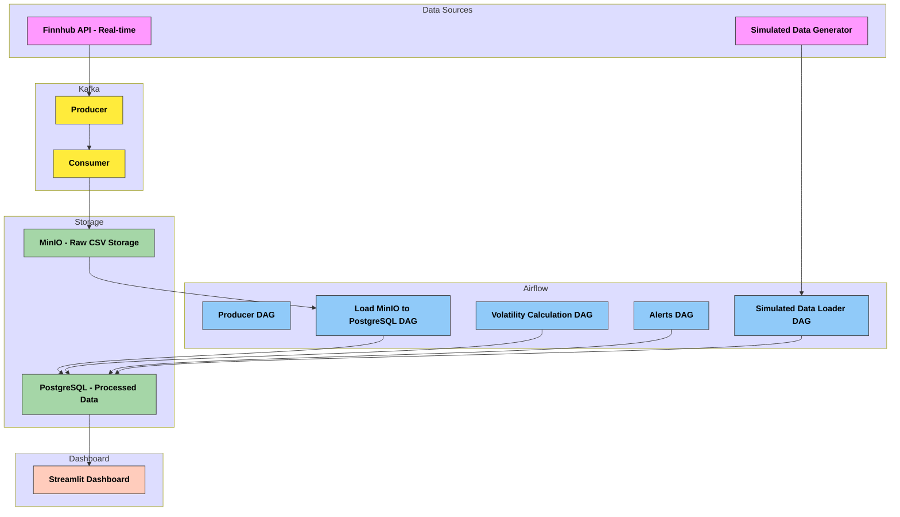

# 📈 Real-Time Stock Volatility Monitoring Pipeline

This project implements a real-time stock analytics pipeline that streams live and simulated stock prices, computes volatility metrics, generates alerts, and visualizes data. It uses a modern stack including Kafka, PostgreSQL, MinIO, Airflow, and Streamlit.

---

## 🚀 Features

| Component     | Tool                   |
| ------------- | ---------------------- |
| Orchestration | Apache Airflow         |
| Messaging     | Apache Kafka           |
| Storage       | PostgreSQL, MinIO      |
| Programming   | Python, Pandas, NumPy  |
| Visualization | Streamlit              |
| Deployment    | Docker, Docker Compose |

- ⏰ **Scheduled Data Ingestion**: Fetches stock price data from an external API every minute using Apache Airflow.
- 🧮 **Volatility Computation**: Calculates rolling volatility, returns, and Sharpe ratio using pandas.
- ⚠️ **Anomaly Detection**: Detects significant volatility spikes and logs risk alerts.
- 🗃️ **Storage in PostgreSQL**: All data and alerts are stored in a PostgreSQL database for durability and queryability.
- 📊 **Streamlit Dashboard**: Interactive UI to visualize metrics and track recent alerts.

---

## 🛠️ Technologies Used

- **Apache Airflow** – Workflow orchestration and scheduling
- **PostgreSQL** – Relational database for storing price, volatility, and alert data
- **Streamlit** – Web dashboard for data visualization
- **Docker & Docker Compose** – Containerization and orchestration
- **Pandas / Plotly** – Data processing and charting
- **psycopg2** – PostgreSQL database connector for Python

---

## 🧱 Architecture Overview

---

## ⚙️ Setup Instructions

- ⏰ **Clone the Repository**
<pre> git clone https://github.com/cvakapoor/stock-volatility-pipeline.git</pre>
<pre> cd stock-volatility-pipeline</pre>
  
- ⏰ **Run PostgreSQL and Airflow**

You can either:

1. Run PostgreSQL and Airflow in separate containers manually, or
2. Integrate both into a unified `docker-compose.yml` setup.

Make sure to update your `docker-compose.yml` accordingly, and drop/recreate the Docker network if needed.

📌 **Note:** Ensure that the Airflow and PostgreSQL services are connected via the same Docker network.

---

## 📊 Streamlit Dashboard

The project includes an interactive **Streamlit dashboard** (streamlit_app.py) to visualize real-time stock metrics, including:
- 📈 **Price Trends** — Line chart of price over time
- 🌪️ **Volatility Metrics** — Visuals for volatility and Sharpe ratio
- ⚠️ **Recent Alerts** — Table of triggered alert messages
  
